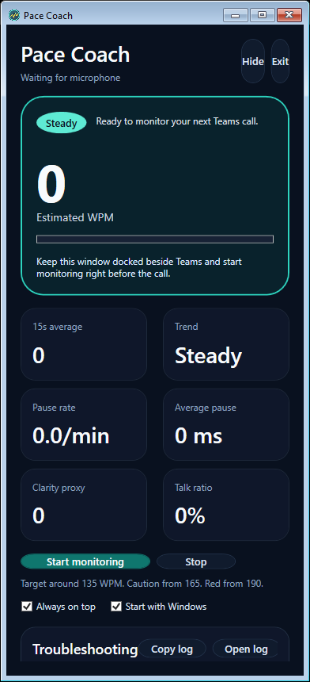

## Overview

PaceApp is a Windows desktop sidecar that helps you slow down on live calls. It opens the same microphone endpoint that Microsoft Teams is using, estimates your live speaking pace, and shows a compact visual warning when you start to rush.

## UI preview



The current implementation is a local-first scaffold that focuses on the core coaching loop:

* Run beside Teams as a small desktop utility
* Capture the active communications microphone in shared mode
* Estimate pace, pauses, clarity proxy, and trend in real time
* Turn the live coaching surface red when pacing gets too aggressive
* Save recent session summaries locally

More detailed implementation notes live in [docs/IMPLEMENTATION.md](docs/IMPLEMENTATION.md).

## Current status

The app is buildable, launches successfully on Windows, and now has a verified self-contained published output under `published\PaceCoach-win-x64`. The first version uses a WPF shell because the local machine did not have WinUI or Windows App SDK templates installed at scaffold time.

The live speed signal is currently estimated from audio peaks and pause structure. It is useful for coaching, but it is not yet a transcript-based words-per-minute pipeline. The detector has been tightened so short phrases and slow introductions are less likely to trip false red alerts, but it remains an approximation.

The supported source-workflow launch path is the root-level visible launcher, `Start-PaceApp.cmd`. It builds the desktop app project, recovers from stale WPF-generated files if needed, and opens the visible PaceApp window with the current troubleshooting panel.

## Solution structure

The solution is split into focused projects so the desktop shell can evolve without rewriting capture and analytics.

* `src/PaceApp.App`: WPF shell, tray behavior, overlay UI, and app orchestration
* `src/PaceApp.Core`: shared models and service contracts
* `src/PaceApp.Audio`: microphone capture and device monitoring
* `src/PaceApp.Analytics`: live pace estimation and alert scoring
* `src/PaceApp.Infrastructure`: local settings and session-history persistence

## Prerequisites

* Windows 10 or Windows 11
* .NET 10 SDK
* A working microphone
* Microphone permission enabled for desktop apps

## Build the app

For the app itself, the most reliable build path is the desktop project:

```powershell
dotnet build .\src\PaceApp.App\PaceApp.App.csproj
```

If you want to build the whole workspace, run:

```powershell
dotnet build .\PaceApp.slnx
```

To regenerate the local double-clickable published build, run:

```powershell
dotnet publish .\src\PaceApp.App\PaceApp.App.csproj -c Release -r win-x64 --self-contained true -o .\published\PaceCoach-win-x64
```

This publish folder is a generated local artifact. It should be regenerated from source after changes, not edited by hand.

## Published app

If you want to launch the app without `dotnet`, use the published executable:

```text
published\PaceCoach-win-x64\PaceApp.App.exe
```

You can double-click that file from File Explorer.

If you package the output after publishing, the zip is typically created at:

```text
published\PaceCoach-win-x64.zip
```

## Run the app

The simplest way to launch the app with the visible Windows UI is:

```powershell
.\Start-PaceApp.cmd
```

You can also double-click [Start-PaceApp.cmd](Start-PaceApp.cmd) in File Explorer.

This launcher resets any existing PaceApp process it can stop, rebuilds the desktop app if needed, and opens a fresh visible window.

For day-to-day source changes, prefer `Start-PaceApp.cmd`. For simple end-user launching, prefer the published `PaceApp.App.exe` in the `published\PaceCoach-win-x64` folder.

If you want to run it from PowerShell directly, use:

```powershell
dotnet run --project .\src\PaceApp.App\PaceApp.App.csproj
```

Tray launch is only for background startup. It hides the main settings window on purpose. Use it only when you explicitly want the app to start in the notification area.

The simplest tray launch is:

```powershell
.\Start-PaceApp-Tray.cmd
```

If you still want the raw project command, it is:

```powershell
dotnet run --project .\src\PaceApp.App\PaceApp.App.csproj -- --tray
```

If you want to see settings, do not use the `--tray` switch.

If you start in tray mode and do not immediately see the icon, check the Windows hidden-icons area in the notification tray.

## Troubleshooting UI

The main window now includes a `Troubleshooting` section.

It shows:

* The current launch mode
* Recent startup and runtime diagnostic messages
* Buttons to copy the diagnostics text or open the log file in Explorer

Diagnostics are also written to:

```text
%LocalAppData%\PaceApp\diagnostics.log
```

If the visible launcher is not opening the window you expect, use `Start-PaceApp.cmd` again. It is the supported way to reset and reopen the UI.

If a second visible launch does not open a second copy, that is expected. PaceApp runs as a single instance and tells the existing window to show itself.

## Use the app during a call

1. Launch PaceApp before or at the start of your Teams call.
2. Keep the window docked beside Teams or your demo surface.
3. Click `Start monitoring`.
4. Watch the live state card.
5. When the card turns caution or red, finish the sentence and pause deliberately before continuing.
6. Click `Stop` after the call to save the session summary.

## What the app stores

PaceApp stores settings and recent session summaries in a local JSON file:

```text
%LocalAppData%\PaceApp\state.json
```

The current implementation does not upload call data and does not require a cloud service to run.

## Key behaviors in the current build

* The app prefers the Windows communications microphone, which is the right default for Teams calls.
* The visible launcher is the recommended way to open settings and diagnostics while working from source.
* The published executable in `published\PaceCoach-win-x64` is the easiest path for simple double-click launching.
* The tray icon uses the custom Pace Coach icon and can reopen the app, hide the window, start or stop monitoring, and exit the process.
* Re-launching the app in visible mode signals an existing PaceApp instance to show its window instead of silently creating an extra hidden instance.
* The `Hide` button sends the window to the tray, while the normal window close exits the process cleanly.
* The `Start with Windows` option writes a per-user Run entry in the current Windows profile and is refreshed to the currently running executable path.
* The main window includes a troubleshooting section with launch mode, recent diagnostic messages, and actions to copy or open the diagnostics log.
* Session summaries include average pace, peak pace, warning-zone time, pause metrics, and a small trend history.

## Known limitations

* The pace estimate is signal-based, not ASR-based, so it is an approximation.
* There is no direct Teams integration or call-state detection yet.
* The shell is WPF for now because WinUI scaffolding was not available locally.
* There are no automated tests yet.
* The repo does not yet include an installer. The supported distributable is the generated publish folder.

## Next steps

* Replace the signal-derived pace estimate with a local transcript-based words-per-minute pipeline.
* Calibrate thresholds with real headset and laptop microphone recordings.
* Add stronger device-change handling and more detailed diagnostics around live call scenarios.
